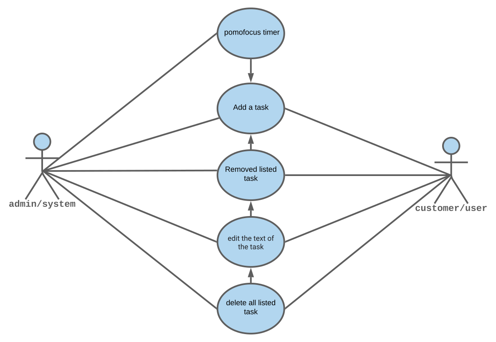
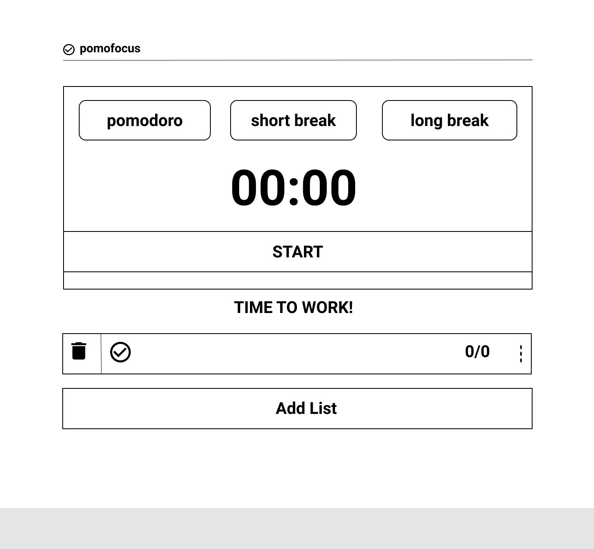

# How to Plan

1. [Brainstorming](#brainstorming)
1. [Prioritizing](#prioritizing)
1. [User Story Dependencies](#user-story-Dependencies)
1. [Acceptance Criteria](#acceptance-criteria)
1. [Defining Tasks](#defining-tasks)
1. [Project Board](#project-board)
1. [Sprinting and Reviewing](#sprinting-and-reviewing)

---

## Brainstorming

> - What user needs and business problem does this app cover?
> - Who is the user?
> - What is the business?

---

## Prioritizing

> How to decide which stories to focus on.

At this stage in planning your team will decide which stories are more aor less important. You will be writing your ideas into a _backlog_.

- [Many Strategies](https://zapier.com/blog/how-to-prioritize)
- The Priority Quadrant
  - [The Quadrant](https://www.youtube.com/watch?v=NGvsxPOmWuw)
  - [Problems with this method](https://www.linkedin.com/pulse/why-prioritization-impacteffort-doesnt-work-itamar-gilad)
- Other Perspectives
  - [Alex Ponomarev](https://medium.com/swlh/prioritizing-user-stories-in-agile-projects-d1dd8dd79165)
  - [Michael Lant](https://michaellant.com/2010/05/21/how-to-easily-prioritize-your-agile-stories/)

---

## Acceptance Criteria

> How you'll know when a story is finished.

Now that you have an idea what the project will eventually be like, it's time to get specific. Acceptance criteria are a way to scope and verify your user stories.

> Given [context] when [a specific action is performed] then [a set of consequences should occur]

You can write your first-draft acceptance criteria in your backlog, later moving them under each user story in your `development-strategy.md`, and ultimately creating a checklist in each issue.

- [Yodiz](https://www.yodiz.com/blog/user-stories-acceptance-definition-and-criteria-in-agile-methodologies/)
- [Zepel](https://zepel.io/agile/acceptance-criteria-for-user-stories/)
- [Ruby Garage](https://rubygarage.org/blog/clear-acceptance-criteria-and-why-its-important)
- [The Infinity Project](https://www.youtube.com/watch?v=KYS0ptJ4JWc)
  1. User Input / User Action
  2. Process
  3. Results

---

## User Story Dependencies

> How to plan your development schedule.

Some user stories depend on each other, some do not. Figuring out these relationships will make it possible go from a disorganized backlog to an organized development strategy.

Understanding these dependencies can also allow you to develop much more efficiently. You can develope user stories that do not depend on each other in parallel instead of waiting for one to finish before moving on the next.

Here are some questions you can ask yourself to help understand your project:

- Do I need _A_ in order to be able to build _B_?
- Can the user do B without A being available?

A nice way to visualize these relationships is by creating a graph to visually represent dependencies:

- [a quiz app](https://excalidraw.com/#json=5248906938023936,dnJz0Qy9tk5M4ho-RUiqYQ)
- [a portfolio example](https://github.com/elewa-student/User-Centered-Development#story-dependencies)

[Excalidraw](https://excalidraw.com/) is a great tool for collaboratively writing these diagrams.

---

## Defining Tasks

> How to break the story into coding tasks.

Answering these questions is a way to break down complex user stories and to determine what code is needed. Following this questions guide will help you fill in the specifications of each step in your `development-strategy.md`

Handlers are the glue of your user stories. Understanding your answers to these questions will not only help you decide which tasks to develop, but can be used to plan the details of the user story's handler:

1. **User Story Objectives**
   1. _What should change in state after this user story is complete?_
   2. _How will the UI represent these state changes for the user?_
2. **User Flow ?**
   
3. **Wireframes ?**
   

- [Lars Bilde](https://www.youtube.com/watch?v=gZ4uLafsxAk)
- [Christiaan Verwijs](https://medium.com/the-liberators/10-powerful-strategies-for-breaking-down-user-stories-in-scrum-with-cheatsheet-2cd9aae7d0eb)

---

## Project Board

> How to manage your team's project

Convert your development strategy into:

- milestones (user stories or steps in your dev-strat). You can include the _acceptance criteria_ as a checklist in the milestone's description
- issues (.js files or small fixes)
- labels (one per concern, plus bugs, help, ...)
- a project board for all the issues

This isn't a permanent thing! You can always adjust the project board, issues and development strategy as the project evolves; adding issues, removing issues, adjusting tasks ... whatever is necessary to make the project go smoothly.

---

## Sprinting and Reviewing

The fun part, writing code and closing issues ;)
